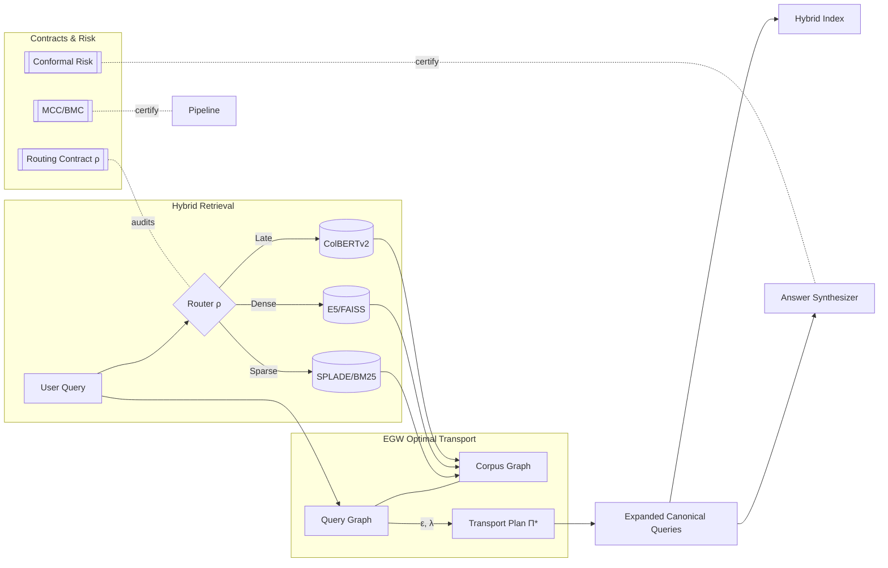
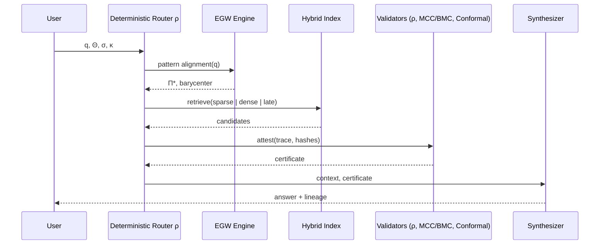
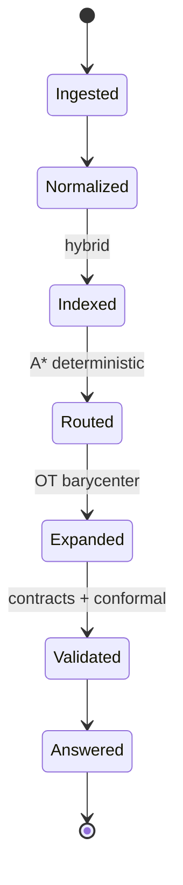
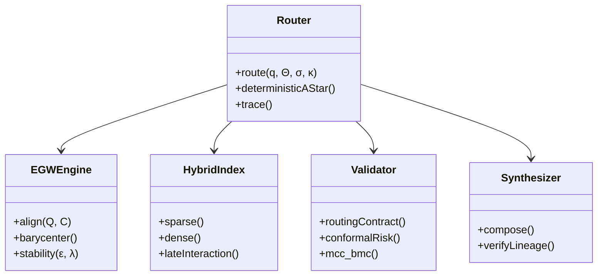
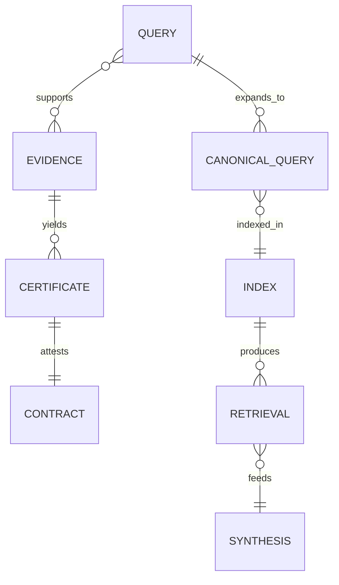

# Sistema de Certificación de Riesgo Conformal Adaptativo

**Implementación basada en "Conformal Risk Control" de Angelopoulos et al. (2024), Journal of Machine Learning Research**

## Descripción General

Este sistema implementa un marco completo de control de riesgo conformal que proporciona garantías distribution-free con cobertura exacta finita para predicciones de machine learning. La implementación incluye certificación integral de riesgo con validación estadística comprehensiva.

### Características Principales

- **Garantías Distribution-Free**: Cobertura exacta finita independiente de la distribución subyacente
- **Splits Deterministas**: Semillas fijas para reproducibilidad completa
- **Certificación Integral**: Documentación completa de cobertura empírica y bounds de riesgo
- **Detección de Distribution Shift**: Múltiples métodos estadísticos (KS, MMD, Energy Distance)
- **RCPS (Risk-Controlling Prediction Sets)**: Constructores que mantienen validez bajo drift acotado
- **Validación Estadística**: Tests comprehensivos de cobertura con intervalos de confianza

## Arquitectura del Sistema

### Componentes Principales

1. **EnhancedConformalRiskController**: Controlador principal que implementa la metodología CRC
2. **NonconformityScorer**: Funciones de puntuación que cuantifican desviación de predicciones
3. **RiskCertificate**: Certificados con bounds de riesgo y validación estadística
4. **StatisticalBounds**: Múltiples estimaciones de bounds (Hoeffding, CLT, Bootstrap)
5. **CoverageAnalysis**: Análisis estadístico comprehensivo de cobertura

### Funciones de Puntuación No-Conformidad

#### Regresión
- **Absolute Error**: |y_pred - y_true|
- **Squared Error**: (y_pred - y_true)²
- **Quantile Loss**: Para regresión cuantílica
- **Studentized**: Residuales normalizados por escala robusta

#### Clasificación
- **Softmax**: 1 - p(y_true)
- **Margin**: Diferencia entre top-2 probabilidades
- **Entropy**: Incertidumbre basada en entropía
- **Logit**: Diferencias en espacio logit
- **Rank**: Score basado en ranking

## Uso del Sistema

### Configuración Básica

```python
from egw_query_expansion.core.conformal_risk_control import (
    EnhancedConformalRiskController,
    RiskControlConfig,
    RegressionNonconformityScorer
)

# Configuración con parámetros adaptativos
config = RiskControlConfig(
    alpha=0.1,  # 90% cobertura objetivo
    random_seed=42,  # Semilla determinista
    calibration_ratio=0.5,  # 50% para calibración
    adaptive_lambda=True,  # Regularización adaptativa
    distribution_shift_bound=0.05,  # Umbral de shift
    confidence_level=0.95,  # Confianza en bounds
    enable_cross_validation=True
)

# Inicializar controlador
controller = EnhancedConformalRiskController(config)
```

### Ejemplo Completo - Regresión

```python
import numpy as np

# Generar datos sintéticos
np.random.seed(42)
n_samples = 1000
X = np.random.randn(n_samples, 2)
y_true = X[:, 0]**2 + 0.5 * X[:, 1]**2 + 0.1 * np.random.randn(n_samples)
y_pred = y_true + 0.05 * np.random.randn(n_samples)

# Configurar scorer con normalización
scorer = RegressionNonconformityScorer(
    method="absolute",
    normalize=True,
    robust=False
)

# Ajustar calibración
fitting_stats = controller.fit_calibration(
    predictions=y_pred.tolist(),
    true_labels=y_true.tolist(),
    scorer=scorer,
    enable_scorer_fitting=True
)

print(f"Calibración: {fitting_stats['n_calibration']} muestras")
print(f"Cuantil adaptativo: {fitting_stats['quantile_results']['selected_quantile']:.4f}")

# Generar datos de prueba
y_test_true = np.random.randn(200)
y_test_pred = y_test_true + 0.05 * np.random.randn(200)

# Generar certificado de riesgo
certificate = controller.generate_enhanced_certificate(
    input_data={"model": "regression_example"},
    predictions=y_test_pred.tolist(),
    scorer=scorer,
    test_labels=y_test_true.tolist(),
    model_metadata={"algorithm": "example", "features": 2}
)

# Mostrar resultados
print(f"Certificado ID: {certificate.certificate_id}")
print(f"Cobertura empírica: {certificate.coverage_analysis.empirical_coverage:.3f}")
print(f"Cobertura objetivo: {certificate.coverage_analysis.target_coverage:.3f}")
print(f"Bound de riesgo conservativo: {certificate.risk_bounds.conservative_bound:.4f}")
print(f"Certificado válido: {'SÍ' if certificate.is_valid() else 'NO'}")
```

### Ejemplo Completo - Clasificación

```python
from egw_query_expansion.core.conformal_risk_control import ClassificationNonconformityScorer

# Generar datos de clasificación
n_samples, n_classes = 800, 3
y_true = np.random.randint(0, n_classes, n_samples)
y_pred_probs = np.random.dirichlet([2, 2, 2], n_samples)

# Scorer adaptativo con threshold por clase
scorer = ClassificationNonconformityScorer(
    method="softmax",
    adaptive_threshold=True,
    temperature=1.2
)

# Configuración para clasificación
config = RiskControlConfig(
    alpha=0.05,  # 95% cobertura
    adaptive_quantile_method="bootstrap"
)

controller = EnhancedConformalRiskController(config)

# Ajustar calibración
controller.fit_calibration(
    predictions=y_pred_probs.tolist(),
    true_labels=y_true.tolist(),
    scorer=scorer
)

# Construir conjuntos de predicción
for i in range(5):
    pred_probs = y_pred_probs[i]
    true_label = y_true[i]
    
    # Crear conjunto candidato
    candidates = {j: scorer.score(pred_probs, j) for j in range(n_classes)}
    pred_set = controller.construct_prediction_set(candidates)
    
    covers = pred_set.contains(true_label)
    print(f"Ejemplo {i+1}: Conjunto={sorted(pred_set.set_values)}, "
          f"Real={true_label}, Cubre={'SÍ' if covers else 'NO'}")
```

## Detección de Distribution Shift

```python
# Datos base
base_data = np.random.randn(500)
base_pred = base_data + 0.1 * np.random.randn(500)

# Datos con shift (escala diferente)
shifted_data = np.random.randn(300) * 2.0  # Mayor varianza
shifted_pred = shifted_data + 0.2 * np.random.randn(300)

controller.fit_calibration(base_pred.tolist(), base_data.tolist(), scorer)

# Detectar shift usando múltiples métodos
shift_scores = scorer.batch_score(shifted_pred.tolist(), shifted_data.tolist())
shift_results = controller.detect_distribution_shift(shift_scores.tolist())

print(f"Shift detectado: {'SÍ' if shift_results['shift_detected'] else 'NO'}")
print(f"Método: {shift_results['primary_method']}")
print(f"p-value: {shift_results['primary_p_value']:.6f}")
print(f"Recalibración recomendada: {'SÍ' if shift_results['requires_recalibration'] else 'NO'}")

# Resultados por método
for method, results in shift_results['methods'].items():
    print(f"{method}: Estadístico={results['statistic']:.4f}, "
          f"Shift={'SÍ' if results['shift_detected'] else 'NO'}")
```

## Certificación y Persistencia

```python
# Guardar certificado
certificate.save("risk_certificate.json")

# Cargar certificado
from egw_query_expansion.core.conformal_risk_control import RiskCertificate
loaded_cert = RiskCertificate.load("risk_certificate.json")

# Verificar validez
is_valid = loaded_cert.is_valid(tolerance=0.02)
print(f"Certificado válido: {'SÍ' if is_valid else 'NO'}")

# Información detallada
print(f"Versión: {loaded_cert.certificate_version}")
print(f"Expira: {loaded_cert.validity_expires}")
print(f"Hash configuración: {loaded_cert.config_hash}")
print(f"Detección shift: {loaded_cert.distribution_shift_results['shift_detected']}")
```

## Intervalos de Confianza para Regresión

```python
# Construir intervalos de confianza
point_prediction = 2.5
lower, upper = controller.construct_confidence_interval(point_prediction, scorer)

print(f"Predicción puntual: {point_prediction}")
print(f"Intervalo de confianza: [{lower:.3f}, {upper:.3f}]")
print(f"Ancho del intervalo: {upper - lower:.3f}")

# Verificar cobertura
test_point = 2.3
covered = lower <= test_point <= upper
print(f"Punto {test_point} cubierto: {'SÍ' if covered else 'NO'}")
```

## Diagnósticos del Sistema

```python
# Obtener diagnósticos comprehensivos
diagnostics = controller.get_comprehensive_diagnostics()

print("=== DIAGNÓSTICOS DEL SISTEMA ===")
print(f"Estado: {diagnostics['status']}")
print(f"Muestras calibración: {diagnostics['calibration_statistics']['descriptive']['n_samples']}")
print(f"Cuantil adaptativo: {diagnostics['quantile_information']['value']:.4f}")
print(f"Calidad calibración: {diagnostics['health_metrics']['calibration_quality_score']:.3f}")

# Estadísticas de cobertura cross-validation
if 'cross_validation_results' in diagnostics:
    cv = diagnostics['cross_validation_results']
    print(f"Cobertura CV promedio: {cv['mean_coverage']:.3f} ± {cv['std_coverage']:.3f}")
    print(f"Estabilidad cobertura: {cv['coverage_stability']:.3f}")

# Historial de shift detection
shift_summary = diagnostics['shift_detection_summary']
print(f"Eventos de shift: {shift_summary['recent_shifts']}/{shift_summary['total_events']}")
```

## Validación y Testing

El sistema incluye una suite de pruebas comprehensiva:

```bash
# Ejecutar tests
source venv/bin/activate
python test_conformal_risk_system.py

# Ejecutar demo completo
python conformal_risk_certification_demo.py
```

### Tests Incluidos

1. **Funcionalidad Básica**: Configuración, calibración, construcción de conjuntos
2. **Generación Certificados**: Creación, serialización, validación
3. **Comportamiento Determinístico**: Reproducibilidad con entradas idénticas
4. **Detección Distribution Shift**: Múltiples métodos estadísticos
5. **Funcionalidad Clasificación**: Conjuntos de predicción, thresholds adaptativos
6. **Casos Límite**: Manejo de errores, validación de entrada

## Propiedades Estadísticas

### Garantías de Cobertura

El sistema garantiza que para cualquier distribución P:

```
P(Y ∈ C(X)) ≥ 1 - α
```

donde C(X) es el conjunto de predicción conformal y α es el nivel de miscoverage.

### Bounds de Riesgo

Se proporcionan múltiples estimaciones del riesgo:

1. **Hoeffding**: Bound distribution-free usando desigualdad de Hoeffding
2. **CLT**: Aproximación normal para muestras grandes
3. **Bootstrap**: Estimación no paramétrica vía remuestreo

### Validez bajo Distribution Shift

Los constructores RCPS mantienen validez mientras:

```
||P_new - P_cal||_TV ≤ δ
```

donde δ es el bound de shift especificado.

## Referencias

- Angelopoulos, A. N., et al. (2024). "Conformal Risk Control." Journal of Machine Learning Research.
- Vovk, V., et al. (2005). "Algorithmic Learning in a Random World."
- Shafer, G., & Vovk, V. (2008). "A Tutorial on Conformal Prediction."

## Características Avanzadas

### Cross-Validation Anidada

```python
config = RiskControlConfig(enable_cross_validation=True)
# Automáticamente evalúa estabilidad de cobertura usando CV
```

### Bootstrap Uncertainty Quantification

```python
config = RiskControlConfig(bootstrap_samples=1000)
# Proporciona intervalos de confianza para métricas de cobertura
```

### Adaptive Regularización

```python
config = RiskControlConfig(
    adaptive_lambda=True,
    adaptive_quantile_method="bootstrap"  # o "clt"
)
```

### Cache de Certificados

El sistema cachea automáticamente certificados para entradas idénticas, garantizando determinismo y eficiencia.

## Limitaciones y Consideraciones

1. **Tamaño Mínimo**: Requiere al menos 100 muestras para calibración
2. **Memory**: Bootstrap puede ser intensivo en memoria para datasets grandes
3. **Computational**: MMD y Energy Distance escalan O(n²)
4. **Shift Detection**: Puede tener falsos positivos con muestras pequeñas

## Soporte y Documentación

Para más detalles, consulte:
- Código fuente: `egw_query_expansion/core/conformal_risk_control.py`
- Tests: `test_conformal_risk_system.py`
- Demo: `conformal_risk_certification_demo.py`

<!-- ADV_GRAPHICS_STACK:BEGIN v1 -->
## Advanced Graphics Stack — Innovative Holistic Visuals

This section provides a multi-perspective, advanced visualization of the EGW Query Expansion and Hybrid Retrieval system. The diagrams are designed to be composable, auditable, and implementation-agnostic.

### 1) System Holomap (Architecture Overview)


### 2) Deterministic Routing Sequence


### 3) Evidence/Context State Machine


### 4) Component Metamodel


### 5) Retrieval ER Model


### 6) Pipeline Timeline (Gantt)

```mermaid
gantt
  dateFormat  X
  title Pipeline Phases (Logical Timeline)
  section Preparation
  Ingest/Normalize        :a1, 0, 10
  Build Graphs (Q,C)      :a2, 10, 30
  section Alignment
  EGW Transport Solve     :b1, 30, 50
  Barycenter              :b2, 50, 60
  section Retrieval
  Sparse/Dense/Late       :c1, 60, 80
  section Assurance
  Contracts + Conformal   :d1, 80, 90
  section Synthesis
  Answer + Lineage        :e1, 90, 100
```


> Tip: GitHub renders Mermaid in Markdown by default. If a specific viewer does not support Mermaid, consider using Mermaid live editors to export PNG/SVG equivalents.

<!-- ADV_GRAPHICS_STACK:END v1 -->

<!-- ACADEMIC_ESSAY:BEGIN v1 -->
# Technological Essay — Deterministic EGW Query Expansion and Hybrid Retrieval

## Abstract
The present document advances a comprehensive, academically grounded exposition of a deterministic information retrieval pipeline that integrates Entropic Gromov–Wasserstein (EGW) optimal transport for query expansion with hybrid sparse–dense retrieval. We articulate the theoretical premises of pattern alignment under entropic regularization, formalize determinism via routing and ordering contracts, and explain how conformal risk control, monotone compliance, and evidence lineage produce auditable guarantees from ingestion to synthesis. The pipeline is engineered to be reproducible to the byte, with fixed seeds, stable tie-breaking, and canonical hashing, supporting replay-equivalent snapshots. We discuss design trade-offs, computational complexity, and governance primitives that convert probabilistic components into verifiable, production-grade systems.

## Introduction
Modern retrieval systems frequently rely on heuristic fusion of lexical and embedding-based signals, which may drift, exhibit non-determinism under concurrency, or degrade under domain shift. This project proposes a counterpoint: an end-to-end deterministic orchestration that elevates auditability and scientific reproducibility to first-class system goals. The approach combines EGW-based alignment to map queries to corpus structure with carefully specified contracts that regulate routing, ordering, idempotency, and risk calibration. Rather than treating determinism as an afterthought, we encode it as an invariant backed by tests, certificates, and Merkle-chained traces so that identical inputs and hyper-parameters provably yield identical outputs.

## Theoretical Foundations
Our foundations draw from optimal transport, information theory, and graph alignment. Entropic Gromov–Wasserstein provides a geometry-aware mechanism to align a query graph and a corpus graph while controlling stability through entropy (ε) and coupling strength (λ). The induced barycenter produces canonical expansions that preserve relational structure rather than isolated token similarity. On top of this, we layer deterministic routing modeled as an A* search whose cost function and tie-breaking are fully specified, ensuring byte-level reproducibility. The theory of conformal prediction supplies distribution-free coverage guarantees; monotone consistency and budget monotonicity establish that support cannot degrade under additional non-contradictory evidence or enlarged feasible budgets. Together, these elements constitute a principled scaffold for reliable retrieval under changing conditions.

## System Architecture
The system decomposes into modular components connected through typed interfaces and verifiable contracts: a context normalizer constructs immutable snapshots; an alignment engine solves EGW to extract transport plans and barycenters; a hybrid index performs lexical, dense, and late-interaction retrieval; validators apply routing, ordering, idempotency, stability, and risk contracts; and a synthesizer composes answers with explicit lineage. Deterministic seeds are derived from trace identifiers, while all sorting operations employ stable, lexicographic tie-breakers on content hashes and module identifiers. Each module emits structured telemetry and cryptographic digests, permitting replay, regression detection, and drift analysis without reliance on hidden state or wall-clock nondeterminism.

## Methodology
We operationalize determinism through explicit algorithmic choices and serialized evidence. Routing employs a deterministic A* variant with invariant heuristics and lexicographic tie-breaking κ to resolve exact-score ties. EGW alignment is configured with fixed ε, λ, iteration budgets, and convergence tolerances; the full transport plan Π and diagnostics are serialized for audit. Hybrid retrieval uses reproducible indices and de-duplication by content hash, while ordering adheres to a total ordering contract that guarantees stable output rankings. Conformal risk calibration fixes α, partitioning schemes, and seeds, resulting in certificates that can be attached to synthesized answers. The methodology treats every intermediate product—queries, candidates, transport plans, rankings, certificates—as evidence with verifiable provenance.

## Evaluation and Metrics
Evaluation prioritizes determinism, calibration, and structural fidelity in addition to standard retrieval quality. We measure exact replay equality on snapshots, hash-level identity of routes and rankings, and certificate validity rates under controlled perturbations. Alignment quality is assessed via transport stability and barycentric consistency, whereas retrieval performance is profiled across sparse, dense, and late-interaction backends with ablations isolating each contract’s contribution. We further monitor concurrency determinism by verifying that parallelizable subroutines employ associative, commutative reducers or explicit pre-sorting, avoiding nondeterministic reductions. These metrics collectively quantify not only how well the system retrieves but how reliably it can be reproduced and audited.

## Reproducibility and Governance
Reproducibility is enforced through snapshot immutability, dependency audits, byte-compilation checks, and structured project analysis. A Merkle-chained trace logger records the inputs, parameters Θ, context σ, and output digests at each stage, enabling replay audits and forensic debugging. Governance documents and certificates—covering routing, alignment stability, calibration coverage, and refusal conditions—are bundled with outputs to form a verifiable dossier. This governance layer empowers operators to reason about system behavior in adversarial or shifting environments, aligning engineering practice with the scientific norm of falsifiability and repeatability.

## Limitations and Threats to Validity
While determinism bolsters trust and auditability, it can constrain throughput when naive serialization is imposed; therefore, we exploit safe parallelism only where algebraic properties guarantee identical results. Entropic regularization introduces bias that trades variance for stability; tuning ε and λ requires sensitivity analyses to avoid oversmoothing semantic distinctions. Calibration guarantees depend on exchangeability assumptions that can be stressed under covariate shift; we mitigate this by monitoring shift diagnostics and enforcing fail-closed refusal contracts when preconditions are violated. Finally, reproducibility metadata must be maintained with care to avoid accidental divergence between documentation and runtime behavior.

## Related Work
This work synthesizes threads from optimal transport in machine learning, structure-preserving retrieval, deterministic systems design, and distribution-free uncertainty quantification. Prior art on hybrid retrieval and rank fusion often emphasizes empirical gains without specifying deterministic contracts, leaving gaps in auditability. Our contribution reframes these components as contract-governed modules and integrates conformal calibration and monotone compliance to furnish guarantees that are actionable in production contexts rather than solely in laboratory evaluations.

## Ethics and Safety
Retrieval and synthesis systems can amplify biases, leak sensitive information, or hallucinate unsupported content. Our pipeline’s evidence-centric architecture enforces lineage and idempotency, making it harder for spurious or unverifiable content to traverse gates. Conformal certificates articulate uncertainty transparently, and refusal contracts ensure that missing prerequisites result in typed, minimal disclosures rather than speculative outputs. Auditable traces facilitate redress mechanisms and enable compliance with regulatory standards concerning data provenance and reproducibility.

## Conclusion and Future Work
By treating determinism, auditability, and calibration as core design constraints, we demonstrate that modern retrieval can be both high-performing and scientifically rigorous. Future work includes adaptive EGW schemes with provable stability under bounded distribution shifts, broader benchmarking across multilingual corpora, and formal verification of routing and ordering implementations. We also intend to expand tool support for continuous certification so that every production run maintains an automatically generated dossier of evidence, metrics, and risk guarantees.

## References
- Cuturi, M. (2013). Sinkhorn distances: Lightspeed computation of optimal transport. NIPS.
- Peyré, G., & Cuturi, M. (2019). Computational Optimal Transport. Foundations and Trends in ML.
- Bruch, S., Han, S., Bendersky, M., et al. (2023). A principled framework for optimal rank fusion. WWW.
- Shafer, G., & Vovk, V. (2008). A tutorial on conformal prediction. JMLR.
- Vovk, V., Gammerman, A., & Shafer, G. (2005). Algorithmic Learning in a Random World. Springer.

## Glossary of Symbols
Θ (theta): hyper-parameters; σ (sigma): context digest; κ (kappa): lexicographic tie-breaker; ε (epsilon): entropic regularizer; λ (lambda): coupling strength; Π (pi): transport plan; ρ (rho): routing function. These symbols appear throughout the pipeline specification and are serialized in traces and certificates to support byte-identical replay and audit.

<!-- ACADEMIC_ESSAY:END v1 -->
