# Deterministic Hybrid Retrieval System

Implementation of a deterministic hybrid retrieval system based on Bruch et al. (2023) "Bridging Dense and Sparse Maximum Inner Product Search" from the International Conference on Machine Learning.

## Overview

This system implements optimal ranking fusion that unifies dense and sparse retrieval methods through learned projections while maintaining complete determinism and reproducibility guarantees.

## Key Features

### 🎯 Deterministic Architecture
- **Content-based hashing**: Documents identified by SHA-256 hash of content
- **Versioned indices**: Immutable snapshots with deterministic IDs
- **Fixed random seeds**: All stochastic operations use controlled randomization
- **Reproducible results**: Identical queries over identical snapshots produce exactly the same results

### 🔬 Optimal Ranking Fusion
- Implementation of Bruch et al. (2023) optimal fusion theorem
- Combines sparse (TF-IDF/SPLADE-style), dense (E5 embeddings), and learned projection components
- Configurable fusion weights (α, β, γ) with normalization
- Score normalization ensures fair combination across modalities

### 🔍 Multi-Modal Retrieval
- **Sparse retrieval**: TF-IDF with fixed vocabulary for lexical matching
- **Dense retrieval**: E5 embeddings with FAISS indexing for semantic similarity
- **Learned projections**: Bridge between dense and sparse representations
- **Query expansion**: Fixed-weight expansion for multi-modal queries

### 🛡️ Filtering and Constraints
- **DNP (Do Not Process) constraints**: Consistent filtering with boolean operators
- **Content deduplication**: Automatic removal of duplicate documents by content hash
- **Metadata filtering**: Support for complex filtering conditions

### 📸 Snapshot Management
- **Immutable snapshots**: Each document collection creates a versioned snapshot
- **Content fingerprinting**: Snapshot IDs based on document collection hash
- **State freezing**: Complete retrieval state captured for reproducibility

## Canonical Flow Integration (Deterministic Pipeline)

The following modules are now integrated deterministically into the canonical pipeline (Stage 6: Search & Retrieval):
- retrieval_engine/lexical_index.py — BM25 lexical index with information-theoretic analytics (entropy, MI, KL, MaxEnt expansion, info gain ordering).
- retrieval_engine/vector_index.py — Vector index with SVD/JL projections and similarity metrics.
- retrieval_engine/hybrid_retriever.py — Hybrid combination with modified Dijkstra planning and Bayesian refinement.
- semantic_reranking/reranker.py — Semantic reranking using KL/MI/Wasserstein proxies with stability controls.

They are executed in the following order (dependencies):
1) lexical_index.py and vector_index.py (from adaptive_controller)
2) hybrid_retriever.py (consumes lexical/vector metrics)
3) semantic_reranking/reranker.py (reranks hybrid candidates)

Metrics are published via orchestration/event_bus.py when available, and tracing is compatible with tracing/decorators.py.

See DETERMINISTIC_FLUX.md for the full, autogenerated stage-by-stage description and execution order.

## Architecture Components

### Core Classes

#### `DeterministicHybridRetriever`
Main retrieval system implementing the hybrid fusion architecture.

```python
retriever = DeterministicHybridRetriever(
    embedding_model_name="intfloat/e5-base-v2",
    device="cpu",
    sparse_alpha=0.4,     # Sparse component weight
    dense_alpha=0.4,      # Dense component weight  
    projection_alpha=0.2, # Projection component weight
    seed=42               # Fixed seed for determinism
)
```

#### `DocumentHash`
Immutable document identifier based on content hashing.

```python
doc_hash = DocumentHash.from_content("Document content", "doc_id")
# content_hash: SHA-256 of content
# doc_id: Human-readable identifier
```

#### `IndexSnapshot`
Immutable snapshot of the retrieval index state.

```python
snapshot = IndexSnapshot.create(documents, embedding_dim, sparse_dim)
# Creates deterministic snapshot ID from content
```

#### `OptimalRankingFusion`
Implementation of the Bruch et al. optimal fusion theorem.

```python
fusion = OptimalRankingFusion(alpha=0.4, beta=0.4)  # γ = 1-α-β = 0.2
results = fusion.fuse_rankings(sparse_results, dense_results, projection_results)
```

#### `QueryExpansion`
Fixed-weight query expansion for multi-modal queries.

```python
expansion = QueryExpansion(
    expansion_weights=(0.8, 0.6, 0.4),
    expansion_radius=0.5,
    max_expansions=3
)
expanded_queries = expansion.expand_query("machine learning", seed=42)
```

#### `DNPConstraint`
Do Not Process constraints for consistent filtering.

```python
constraint = DNPConstraint(field="category", operator="eq", value="private")
# Filters out documents where metadata["category"] == "private"
```

### Fusion Algorithm

The system implements the optimal fusion theorem from Bruch et al. (2023):

1. **Multi-modal scoring**: Generate scores from sparse, dense, and projection components
2. **Score normalization**: Normalize each component's scores to [0, 1] range
3. **Weighted combination**: Apply fusion weights: `final_score = α·sparse + β·dense + γ·projection`
4. **Ranking**: Sort by final fusion scores with deterministic tie-breaking

## Usage Examples

### Basic Retrieval

```python
from deterministic_hybrid_retrieval import DeterministicHybridRetriever

# Initialize system
retriever = DeterministicHybridRetriever(seed=42)

# Add documents
documents = [
    "Machine learning algorithms for data analysis",
    "Deep neural networks and artificial intelligence", 
    "Natural language processing techniques"
]
snapshot = retriever.add_documents(documents)

# Search
result = retriever.search("machine learning", top_k=3)
print(f"Found {len(result.doc_hashes)} documents")
print(f"Snapshot: {result.snapshot_id}")
```

### Query Expansion

```python
from deterministic_hybrid_retrieval import QueryExpansion

expansion_config = QueryExpansion(
    expansion_weights=(0.8, 0.6),
    expansion_radius=0.5,
    max_expansions=2
)

result = retriever.search(
    "neural networks",
    expansion_config=expansion_config
)
```

### DNP Constraints

```python
from deterministic_hybrid_retrieval import DNPConstraint

# Filter out private documents
dnp_constraint = DNPConstraint(
    field="category", 
    operator="eq", 
    value="private"
)

# Add documents with metadata
metadata = [
    {"category": "public", "domain": "ai"},
    {"category": "private", "domain": "internal"}
]

retriever.add_documents(documents, metadata=metadata)

# Search with filtering
result = retriever.search(
    "machine learning",
    dnp_constraints=[dnp_constraint]
)
```

### Determinism Verification

```python
# Verify multiple searches produce identical results
is_deterministic = retriever.verify_determinism("test query", num_trials=5)
print(f"System is deterministic: {is_deterministic}")

# Get reproducibility information
repro_info = retriever.get_reproducibility_info()
print(f"System seed: {repro_info['seed']}")
print(f"Snapshot ID: {repro_info['current_snapshot']['snapshot_id']}")
```

## Determinism Guarantees

The system provides the following determinism guarantees:

### Content-Based Identification
- Documents identified by SHA-256 hash of content
- Identical content always produces identical hash
- Automatic deduplication prevents index corruption

### Versioned Indices  
- Each document collection creates immutable snapshot
- Snapshot ID deterministically computed from content
- Index state completely frozen for reproducibility

### Fixed Parameters
- All random seeds controlled and fixed
- Model parameters frozen during initialization  
- Fusion weights configurable but immutable after creation

### Query Processing
- Query expansion uses fixed weights and deterministic algorithms
- Score normalization applied consistently
- Ranking uses stable sorting with deterministic tie-breaking

### Result Consistency
- Identical queries over identical snapshots produce identical results
- Document ordering preserved across multiple runs
- Score values deterministic to machine precision

## Performance Considerations

### Scalability
- FAISS indexing for efficient similarity search
- Batch processing support for multiple queries
- Memory-efficient sparse representations

### Optimization
- Single-threaded FAISS operations ensure determinism
- Fixed vocabulary size limits memory usage
- Normalized embeddings improve search quality

### Caching
- Snapshot-based caching prevents recomputation
- Content hashes enable efficient deduplication  
- Metadata indexing for fast constraint evaluation

## Installation

```bash
# Create virtual environment
python -m venv venv
source venv/bin/activate

# Install dependencies
pip install -r requirements.txt

# Run tests
python simple_test.py

# Run demo
python demo_deterministic_retrieval.py
```

## Testing

The system includes comprehensive tests for determinism:

- Document hash consistency
- Query expansion determinism  
- Fusion algorithm reproducibility
- Cross-session result consistency
- Constraint filtering accuracy

```bash
# Run basic tests (no pytest required)
python simple_test.py

# Run demo with verification
python demo_deterministic_retrieval.py
```

## Research Background

This implementation is based on:

**Bruch, S., Zoghi, M., Bendersky, M., & Najork, M. (2023).** "Bridging Dense and Sparse Maximum Inner Product Search" *International Conference on Machine Learning*.

### Key Contributions

1. **Theoretical Foundation**: Optimal fusion theorem for combining dense and sparse retrieval
2. **Learned Projections**: Bridge representations between modalities  
3. **Unified Framework**: Single architecture for multi-modal retrieval
4. **Empirical Validation**: Strong performance on information retrieval benchmarks

### Implementation Extensions

This implementation adds several practical extensions:

- **Complete Determinism**: Reproducibility guarantees beyond the original paper
- **Content-Based Versioning**: Snapshot management for production systems
- **Constraint Filtering**: DNP constraints for real-world deployment
- **Multi-Query Expansion**: Fixed-weight expansion strategies

## Production Deployment

### Configuration Management
- All parameters externally configurable
- Snapshot-based deployment enables rollbacks
- Deterministic behavior simplifies debugging

### Monitoring and Validation
- Built-in determinism verification
- Reproducibility information extraction
- Performance metrics collection

### Integration Points
- REST API compatible architecture
- Batch processing capabilities
- Metadata filtering support

## Future Extensions

### Planned Enhancements
- **Multi-GPU Support**: Distributed processing while maintaining determinism
- **Incremental Updates**: Efficient index updates with snapshot preservation
- **Advanced Projections**: Learned projection training from retrieval data
- **Query Analysis**: Automatic expansion weight optimization

### Research Directions
- **Optimal Fusion Theory**: Extensions to more than three modalities
- **Adaptive Weighting**: Dynamic fusion weights based on query characteristics
- **Cross-Modal Learning**: Joint training of projection and fusion components

## License and Attribution

This implementation follows the theoretical framework from Bruch et al. (2023) while adding practical extensions for production deployment. The core optimal fusion algorithm maintains fidelity to the original research while ensuring complete determinism and reproducibility.

<!-- ADV_GRAPHICS_STACK:BEGIN v1 -->
## Advanced Graphics Stack — Innovative Holistic Visuals

This section provides a multi-perspective, advanced visualization of the EGW Query Expansion and Hybrid Retrieval system. The diagrams are designed to be composable, auditable, and implementation-agnostic.

### 1) System Holomap (Architecture Overview)

```mermaid
flowchart LR
  %% Clusters
  subgraph Retrieval["Hybrid Retrieval"]
    A[User Query] --> B{Router ρ}
    B -->|Sparse| S[(SPLADE/BM25)]
    B -->|Dense| D[(E5/FAISS)]
    B -->|Late| L[(ColBERTv2)]
  end
  subgraph OT["EGW Optimal Transport"]
    Q[Query Graph] --- C[Corpus Graph]
    Q -->|ε, λ| T[Transport Plan Π*]
  end
  subgraph Assurance["Contracts & Risk"]
    V1[[Routing Contract ρ]]
    V2[[Conformal Risk]]
    V3[[MCC/BMC]]
  end

  A --> Q
  S & D & L --> C
  T --> R[Expanded Canonical Queries]
  R --> Index[Hybrid Index]
  R --> Answer[Answer Synthesizer]
  V1 -. audits .- B
  V2 -. certify .- Answer
  V3 -. certify .- Pipeline
```


### 2) Deterministic Routing Sequence

```mermaid
sequenceDiagram
  participant U as User
  participant R as Deterministic Router ρ
  participant OT as EGW Engine
  participant H as Hybrid Index
  participant V as Validators (ρ, MCC/BMC, Conformal)
  participant S as Synthesizer
  U->>R: q, Θ, σ, κ
  R->>OT: pattern alignment(q)
  OT-->>R: Π*, barycenter
  R->>H: retrieve(sparse | dense | late)
  H-->>R: candidates
  R->>V: attest(trace, hashes)
  V-->>R: certificate
  R->>S: context, certificate
  S-->>U: answer + lineage
```


### 3) Evidence/Context State Machine


### 4) Component Metamodel

```mermaid
classDiagram
  class Router {
    +route(q, Θ, σ, κ)
    +deterministicAStar()
    +trace()
  }
  class EGWEngine {
    +align(Q, C)
    +barycenter()
    +stability(ε, λ)
  }
  class HybridIndex {
    +sparse()
    +dense()
    +lateInteraction()
  }
  class Validator {
    +routingContract()
    +conformalRisk()
    +mcc_bmc()
  }
  class Synthesizer {
    +compose()
    +verifyLineage()
  }
  Router --> EGWEngine
  Router --> HybridIndex
  Router --> Validator
  Router --> Synthesizer
```


### 5) Retrieval ER Model


### 6) Pipeline Timeline (Gantt)


> Tip: GitHub renders Mermaid in Markdown by default. If a specific viewer does not support Mermaid, consider using Mermaid live editors to export PNG/SVG equivalents.

<!-- ADV_GRAPHICS_STACK:END v1 -->

<!-- ACADEMIC_ESSAY:BEGIN v1 -->
# Technological Essay — Deterministic EGW Query Expansion and Hybrid Retrieval

## Abstract
The present document advances a comprehensive, academically grounded exposition of a deterministic information retrieval pipeline that integrates Entropic Gromov–Wasserstein (EGW) optimal transport for query expansion with hybrid sparse–dense retrieval. We articulate the theoretical premises of pattern alignment under entropic regularization, formalize determinism via routing and ordering contracts, and explain how conformal risk control, monotone compliance, and evidence lineage produce auditable guarantees from ingestion to synthesis. The pipeline is engineered to be reproducible to the byte, with fixed seeds, stable tie-breaking, and canonical hashing, supporting replay-equivalent snapshots. We discuss design trade-offs, computational complexity, and governance primitives that convert probabilistic components into verifiable, production-grade systems.

## Introduction
Modern retrieval systems frequently rely on heuristic fusion of lexical and embedding-based signals, which may drift, exhibit non-determinism under concurrency, or degrade under domain shift. This project proposes a counterpoint: an end-to-end deterministic orchestration that elevates auditability and scientific reproducibility to first-class system goals. The approach combines EGW-based alignment to map queries to corpus structure with carefully specified contracts that regulate routing, ordering, idempotency, and risk calibration. Rather than treating determinism as an afterthought, we encode it as an invariant backed by tests, certificates, and Merkle-chained traces so that identical inputs and hyper-parameters provably yield identical outputs.

## Theoretical Foundations
Our foundations draw from optimal transport, information theory, and graph alignment. Entropic Gromov–Wasserstein provides a geometry-aware mechanism to align a query graph and a corpus graph while controlling stability through entropy (ε) and coupling strength (λ). The induced barycenter produces canonical expansions that preserve relational structure rather than isolated token similarity. On top of this, we layer deterministic routing modeled as an A* search whose cost function and tie-breaking are fully specified, ensuring byte-level reproducibility. The theory of conformal prediction supplies distribution-free coverage guarantees; monotone consistency and budget monotonicity establish that support cannot degrade under additional non-contradictory evidence or enlarged feasible budgets. Together, these elements constitute a principled scaffold for reliable retrieval under changing conditions.

## System Architecture
The system decomposes into modular components connected through typed interfaces and verifiable contracts: a context normalizer constructs immutable snapshots; an alignment engine solves EGW to extract transport plans and barycenters; a hybrid index performs lexical, dense, and late-interaction retrieval; validators apply routing, ordering, idempotency, stability, and risk contracts; and a synthesizer composes answers with explicit lineage. Deterministic seeds are derived from trace identifiers, while all sorting operations employ stable, lexicographic tie-breakers on content hashes and module identifiers. Each module emits structured telemetry and cryptographic digests, permitting replay, regression detection, and drift analysis without reliance on hidden state or wall-clock nondeterminism.

## Methodology
We operationalize determinism through explicit algorithmic choices and serialized evidence. Routing employs a deterministic A* variant with invariant heuristics and lexicographic tie-breaking κ to resolve exact-score ties. EGW alignment is configured with fixed ε, λ, iteration budgets, and convergence tolerances; the full transport plan Π and diagnostics are serialized for audit. Hybrid retrieval uses reproducible indices and de-duplication by content hash, while ordering adheres to a total ordering contract that guarantees stable output rankings. Conformal risk calibration fixes α, partitioning schemes, and seeds, resulting in certificates that can be attached to synthesized answers. The methodology treats every intermediate product—queries, candidates, transport plans, rankings, certificates—as evidence with verifiable provenance.

## Evaluation and Metrics
Evaluation prioritizes determinism, calibration, and structural fidelity in addition to standard retrieval quality. We measure exact replay equality on snapshots, hash-level identity of routes and rankings, and certificate validity rates under controlled perturbations. Alignment quality is assessed via transport stability and barycentric consistency, whereas retrieval performance is profiled across sparse, dense, and late-interaction backends with ablations isolating each contract’s contribution. We further monitor concurrency determinism by verifying that parallelizable subroutines employ associative, commutative reducers or explicit pre-sorting, avoiding nondeterministic reductions. These metrics collectively quantify not only how well the system retrieves but how reliably it can be reproduced and audited.

## Reproducibility and Governance
Reproducibility is enforced through snapshot immutability, dependency audits, byte-compilation checks, and structured project analysis. A Merkle-chained trace logger records the inputs, parameters Θ, context σ, and output digests at each stage, enabling replay audits and forensic debugging. Governance documents and certificates—covering routing, alignment stability, calibration coverage, and refusal conditions—are bundled with outputs to form a verifiable dossier. This governance layer empowers operators to reason about system behavior in adversarial or shifting environments, aligning engineering practice with the scientific norm of falsifiability and repeatability.

## Limitations and Threats to Validity
While determinism bolsters trust and auditability, it can constrain throughput when naive serialization is imposed; therefore, we exploit safe parallelism only where algebraic properties guarantee identical results. Entropic regularization introduces bias that trades variance for stability; tuning ε and λ requires sensitivity analyses to avoid oversmoothing semantic distinctions. Calibration guarantees depend on exchangeability assumptions that can be stressed under covariate shift; we mitigate this by monitoring shift diagnostics and enforcing fail-closed refusal contracts when preconditions are violated. Finally, reproducibility metadata must be maintained with care to avoid accidental divergence between documentation and runtime behavior.

## Related Work
This work synthesizes threads from optimal transport in machine learning, structure-preserving retrieval, deterministic systems design, and distribution-free uncertainty quantification. Prior art on hybrid retrieval and rank fusion often emphasizes empirical gains without specifying deterministic contracts, leaving gaps in auditability. Our contribution reframes these components as contract-governed modules and integrates conformal calibration and monotone compliance to furnish guarantees that are actionable in production contexts rather than solely in laboratory evaluations.

## Ethics and Safety
Retrieval and synthesis systems can amplify biases, leak sensitive information, or hallucinate unsupported content. Our pipeline’s evidence-centric architecture enforces lineage and idempotency, making it harder for spurious or unverifiable content to traverse gates. Conformal certificates articulate uncertainty transparently, and refusal contracts ensure that missing prerequisites result in typed, minimal disclosures rather than speculative outputs. Auditable traces facilitate redress mechanisms and enable compliance with regulatory standards concerning data provenance and reproducibility.

## Conclusion and Future Work
By treating determinism, auditability, and calibration as core design constraints, we demonstrate that modern retrieval can be both high-performing and scientifically rigorous. Future work includes adaptive EGW schemes with provable stability under bounded distribution shifts, broader benchmarking across multilingual corpora, and formal verification of routing and ordering implementations. We also intend to expand tool support for continuous certification so that every production run maintains an automatically generated dossier of evidence, metrics, and risk guarantees.

## References
- Cuturi, M. (2013). Sinkhorn distances: Lightspeed computation of optimal transport. NIPS.
- Peyré, G., & Cuturi, M. (2019). Computational Optimal Transport. Foundations and Trends in ML.
- Bruch, S., Han, S., Bendersky, M., et al. (2023). A principled framework for optimal rank fusion. WWW.
- Shafer, G., & Vovk, V. (2008). A tutorial on conformal prediction. JMLR.
- Vovk, V., Gammerman, A., & Shafer, G. (2005). Algorithmic Learning in a Random World. Springer.

## Glossary of Symbols
Θ (theta): hyper-parameters; σ (sigma): context digest; κ (kappa): lexicographic tie-breaker; ε (epsilon): entropic regularizer; λ (lambda): coupling strength; Π (pi): transport plan; ρ (rho): routing function. These symbols appear throughout the pipeline specification and are serialized in traces and certificates to support byte-identical replay and audit.

<!-- ACADEMIC_ESSAY:END v1 -->
