# Sistema de Enrutamiento Determinista

Sistema de enrutamiento determinista basado en optimización convexa que implementa el teorema de Abernethy et al. (2022) "Faster Projection-Free Online Learning" para garantizar convergencia única mediante proyecciones deterministas sobre politopos convexos.

## Características Principales

### 🎯 Determinismo Absoluto
- **Entradas idénticas → Rutas idénticas**: Garantiza que las mismas entradas produzcan siempre las mismas secuencias de enrutamiento, independientemente del momento o lugar de ejecución.
- **Semillas deterministas**: Cada decisión se deriva de manera determinista usando hashes criptográficos del contexto.

### 🔒 Configuración Inmutable
- **Espacio de configuración congelado**: Los parámetros se fijan al inicio mediante hashing criptográfico SHA256.
- **Inmutabilidad garantizada**: No es posible modificar la configuración después de la creación.

### 📐 Optimización Convexa
- **Proyecciones sobre símplex de probabilidad**: Implementa algoritmos deterministas para proyección en politopos convexos.
- **Convergencia única**: Garantiza convergencia a una solución única usando métricas L2.

### 🔍 Trazabilidad Completa
- **Registro de decisiones**: Cada paso de enrutamiento se registra con justificaciones completas.
- **Reconstrucción de caminos**: Permite reconstruir completamente el camino tomado desde los logs.
- **IDs de trazabilidad**: Cada decisión tiene un identificador único para auditoría.

### ⚖️ Comparador de Orden Total
- **Resolución de empates**: Usa ordenamiento lexicográfico sobre hashes de contenido.
- **Orden total consistente**: Garantiza un orden determinista para todas las acciones posibles.

## Arquitectura del Sistema

### Componentes Principales

#### 1. DeterministicRouter
El componente principal que orquesta todo el sistema de enrutamiento.

```python
from egw_query_expansion.core.deterministic_router import (
    create_deterministic_router,
    RoutingContext
)

# Crear router con configuración personalizada
router = create_deterministic_router({
    'projection_tolerance': 1e-6,
    'max_iterations': 100,
    'convergence_threshold': 1e-8
})

# Crear contexto de enrutamiento
context = RoutingContext.from_query(
    query="What is machine learning?",
    embedding=[0.1, 0.2, 0.3, 0.4],
    corpus_size=10000,
    mode="hybrid"
)

# Enrutar la consulta
decisions = router.route_query(context)
```

#### 2. ImmutableConfig
Configuración inmutable con hash criptográfico:

```python
from egw_query_expansion.core.deterministic_router import ImmutableConfig

config = ImmutableConfig(
    projection_tolerance=1e-6,
    max_iterations=1000,
    convergence_threshold=1e-8,
    lexicographic_tie_breaker=True
)

print(f"Config hash: {config.config_hash}")
# Config hash: 256071ad8f8b4c...
```

#### 3. ConvexProjector
Implementa proyecciones deterministas sobre politopos convexos:

```python
projector = ConvexProjector(config)

# Proyección al símplex de probabilidad
point = [1.0, 2.0, 3.0]
projected = projector.project_to_simplex(point)
# projected: [0.0, 0.0, 1.0] (suma = 1.0)

# Proyección a restricciones de caja
point = [-1.0, 0.5, 2.0]
projected = projector.project_to_box(point, bounds=(0.0, 1.0))
# projected: [0.0, 0.5, 1.0]
```

#### 4. Tipos de Acciones
El sistema define un conjunto de acciones de enrutamiento:

```python
from egw_query_expansion.core.deterministic_router import ActionType

# Acciones disponibles:
ActionType.ROUTE_TO_SPARSE      # Enrutamiento a recuperación dispersa
ActionType.ROUTE_TO_DENSE       # Enrutamiento a recuperación densa
ActionType.ROUTE_TO_COLBERT     # Enrutamiento a ColBERT
ActionType.APPLY_EGW_EXPANSION  # Aplicar expansión EGW
ActionType.COMBINE_RESULTS      # Combinar resultados
ActionType.VALIDATE_OUTPUT      # Validar salida
```

### Derivación de Semillas

El sistema usa derivación determinista de semillas para vincular decisiones con trazabilidad:

```python
from egw_query_expansion.core.deterministic_router import SeedDerivation

seed = SeedDerivation.derive_seed(
    context=routing_context,
    step_id=1,
    module_id="egw_router",
    config_hash=config.config_hash
)

trace_id = SeedDerivation.generate_traceability_id(context, step_id)
```

### Comparador Lexicográfico

Resuelve empates mediante ordenamiento lexicográfico:

```python
from egw_query_expansion.core.deterministic_router import LexicographicComparator

comparator = LexicographicComparator()
result = comparator.compare_actions(
    ActionType.ROUTE_TO_SPARSE,
    ActionType.ROUTE_TO_DENSE,
    "hash1", "hash2"
)
# result: -1 (SPARSE tiene prioridad menor que DENSE)
```

## Propiedades Fundamentales

### ✅ Pureza Funcional
- **Sin efectos secundarios**: Todas las funciones son puras.
- **Sin dependencias temporales**: El resultado no depende del momento de ejecución.
- **Inmutabilidad**: Todos los objetos de datos son inmutables.

### ✅ Determinismo
- **Reproducibilidad**: Entradas idénticas siempre producen salidas idénticas.
- **Independencia del contexto**: El resultado no depende del estado externo.
- **Verificación automática**: Incluye métodos para verificar el determinismo.

### ✅ Trazabilidad Completa
- **Registro exhaustivo**: Cada decisión se registra con justificación completa.
- **Reconstrucción**: Permite reconstruir el camino completo desde los logs.
- **Auditoría**: Cada paso tiene identificadores únicos para auditoría.

## Casos de Uso

### 1. Enrutamiento de Consultas
```python
# Diferentes modos de recuperación
modes = ["sparse", "dense", "colbert", "hybrid"]

for mode in modes:
    context = RoutingContext.from_query(query, embedding, corpus_size, mode)
    decisions = router.route_query(context)
    print(f"{mode}: {[d.action.value for d in decisions]}")
```

### 2. Verificación de Determinismo
```python
# Verificar que múltiples ejecuciones son idénticas
is_deterministic = router.verify_determinism(context, num_trials=5)
print(f"Sistema determinista: {is_deterministic}")
```

### 3. Reconstrucción de Caminos
```python
# Reconstruir el camino completo
path = router.reconstruct_path(context.query_hash)
for step in path:
    print(f"Step {step['step_id']}: {step['action']} - {step['justification']}")
```

### 4. Análisis de Estadísticas
```python
# Obtener estadísticas de enrutamiento
stats = router.get_routing_statistics()
print(f"Total decisiones: {stats['total_decisions']}")
print(f"Distribución de acciones: {stats['action_distribution']}")
print(f"Convergencia promedio: {stats['average_convergence']}")
```

## Pruebas y Validación

### Ejecución de Pruebas
```bash
# Pruebas básicas (sin dependencias externas)
python3 test_deterministic_router_simple.py

# Pruebas completas del sistema
python3 test_full_deterministic_router.py

# Demostración interactiva
python3 demo_deterministic_router.py
```

### Validación de Propiedades
El sistema incluye pruebas automáticas para verificar:
- ✅ Determinismo absoluto
- ✅ Proyecciones convexas correctas
- ✅ Inmutabilidad de la configuración
- ✅ Trazabilidad completa
- ✅ Orden lexicográfico consistente

## Fundamentos Teóricos

### Teorema Base (Abernethy et al., 2022)
El sistema implementa los principios de "Faster Projection-Free Online Learning":

1. **Optimización Convexa**: Usa proyecciones sobre politopos convexos.
2. **Convergencia Garantizada**: Algoritmos que convergen a solución única.
3. **Eficiencia Computacional**: Proyecciones libres de gradiente.

### Algoritmos de Proyección

#### Proyección al Símplex
```python
def project_to_simplex(self, point):
    """Proyección determinista al símplex de probabilidad Δ^n"""
    n = len(point)
    sorted_indices = sorted(range(n), key=lambda i: point[i], reverse=True)
    
    # Encontrar el umbral para proyección
    cumsum = 0.0
    for i, idx in enumerate(sorted_indices):
        cumsum += point[idx]
        threshold = (cumsum - 1.0) / (i + 1)
        if i == n - 1 or point[sorted_indices[i + 1]] <= threshold:
            break
    
    # Aplicar proyección
    projected = [max(point[i] - threshold, 0.0) for i in range(n)]
    
    # Normalizar para garantizar restricción exacta del símplex
    projected_sum = sum(projected)
    if projected_sum > 0:
        projected = [p / projected_sum for p in projected]
    
    return projected
```

#### Métrica de Convergencia
```python
def compute_convergence_metric(self, current, previous):
    """Métrica L2 de convergencia entre iteraciones"""
    diff_squared = [(c - p)**2 for c, p in zip(current, previous)]
    return math.sqrt(sum(diff_squared))
```

## Extensibilidad

### Nuevas Acciones
Para agregar nuevas acciones de enrutamiento:

```python
class ActionType(Enum):
    ROUTE_TO_SPARSE = "route_to_sparse"
    ROUTE_TO_DENSE = "route_to_dense"
    ROUTE_TO_COLBERT = "route_to_colbert"
    # Agregar nueva acción
    ROUTE_TO_NEW_METHOD = "route_to_new_method"
```

### Nuevos Algoritmos de Proyección
Para implementar nuevas proyecciones convexas:

```python
class ConvexProjector:
    def project_to_custom_polytope(self, point, constraints):
        """Implementar nueva proyección personalizada"""
        # Lógica de proyección específica
        pass
```

## Consideraciones de Rendimiento

- **Cache LRU**: Los pesos de enrutamiento se cachean para eficiencia.
- **Operaciones O(n)**: Las proyecciones son computacionalmente eficientes.
- **Memoria Constante**: Uso de memoria independiente del tamaño del corpus.

## Limitaciones y Consideraciones

1. **Dependencia de Hashes**: El determinismo depende de la consistencia de funciones hash.
2. **Precisión Numérica**: Usa tolerancias para comparaciones de punto flotante.
3. **Escalabilidad**: Diseñado para manejar hasta ~100K decisiones de enrutamiento.

## Referencias

- Abernethy, J., et al. (2022). "Faster Projection-Free Online Learning". Conference on Learning Theory.
- Boyd, S. & Vandenberghe, L. (2004). "Convex Optimization". Cambridge University Press.
- Duchi, J., et al. (2008). "Efficient Projections onto the l1-Ball for Learning in High Dimensions".

<!-- ADV_GRAPHICS_STACK:BEGIN v1 -->
## Advanced Graphics Stack — Innovative Holistic Visuals

This section provides a multi-perspective, advanced visualization of the EGW Query Expansion and Hybrid Retrieval system. The diagrams are designed to be composable, auditable, and implementation-agnostic.

### 1) System Holomap (Architecture Overview)

```mermaid
flowchart LR
  %% Clusters
  subgraph Retrieval["Hybrid Retrieval"]
    A[User Query] --> B{Router ρ}
    B -->|Sparse| S[(SPLADE/BM25)]
    B -->|Dense| D[(E5/FAISS)]
    B -->|Late| L[(ColBERTv2)]
  end
  subgraph OT["EGW Optimal Transport"]
    Q[Query Graph] --- C[Corpus Graph]
    Q -->|ε, λ| T[Transport Plan Π*]
  end
  subgraph Assurance["Contracts & Risk"]
    V1[[Routing Contract ρ]]
    V2[[Conformal Risk]]
    V3[[MCC/BMC]]
  end

  A --> Q
  S & D & L --> C
  T --> R[Expanded Canonical Queries]
  R --> Index[Hybrid Index]
  R --> Answer[Answer Synthesizer]
  V1 -. audits .- B
  V2 -. certify .- Answer
  V3 -. certify .- Pipeline
```


### 2) Deterministic Routing Sequence

```mermaid
sequenceDiagram
  participant U as User
  participant R as Deterministic Router ρ
  participant OT as EGW Engine
  participant H as Hybrid Index
  participant V as Validators (ρ, MCC/BMC, Conformal)
  participant S as Synthesizer
  U->>R: q, Θ, σ, κ
  R->>OT: pattern alignment(q)
  OT-->>R: Π*, barycenter
  R->>H: retrieve(sparse | dense | late)
  H-->>R: candidates
  R->>V: attest(trace, hashes)
  V-->>R: certificate
  R->>S: context, certificate
  S-->>U: answer + lineage
```


### 3) Evidence/Context State Machine


### 4) Component Metamodel

```mermaid
classDiagram
  class Router {
    +route(q, Θ, σ, κ)
    +deterministicAStar()
    +trace()
  }
  class EGWEngine {
    +align(Q, C)
    +barycenter()
    +stability(ε, λ)
  }
  class HybridIndex {
    +sparse()
    +dense()
    +lateInteraction()
  }
  class Validator {
    +routingContract()
    +conformalRisk()
    +mcc_bmc()
  }
  class Synthesizer {
    +compose()
    +verifyLineage()
  }
  Router --> EGWEngine
  Router --> HybridIndex
  Router --> Validator
  Router --> Synthesizer
```


### 5) Retrieval ER Model


### 6) Pipeline Timeline (Gantt)


> Tip: GitHub renders Mermaid in Markdown by default. If a specific viewer does not support Mermaid, consider using Mermaid live editors to export PNG/SVG equivalents.

<!-- ADV_GRAPHICS_STACK:END v1 -->

<!-- ACADEMIC_ESSAY:BEGIN v1 -->
# Technological Essay — Deterministic EGW Query Expansion and Hybrid Retrieval

## Abstract
The present document advances a comprehensive, academically grounded exposition of a deterministic information retrieval pipeline that integrates Entropic Gromov–Wasserstein (EGW) optimal transport for query expansion with hybrid sparse–dense retrieval. We articulate the theoretical premises of pattern alignment under entropic regularization, formalize determinism via routing and ordering contracts, and explain how conformal risk control, monotone compliance, and evidence lineage produce auditable guarantees from ingestion to synthesis. The pipeline is engineered to be reproducible to the byte, with fixed seeds, stable tie-breaking, and canonical hashing, supporting replay-equivalent snapshots. We discuss design trade-offs, computational complexity, and governance primitives that convert probabilistic components into verifiable, production-grade systems.

## Introduction
Modern retrieval systems frequently rely on heuristic fusion of lexical and embedding-based signals, which may drift, exhibit non-determinism under concurrency, or degrade under domain shift. This project proposes a counterpoint: an end-to-end deterministic orchestration that elevates auditability and scientific reproducibility to first-class system goals. The approach combines EGW-based alignment to map queries to corpus structure with carefully specified contracts that regulate routing, ordering, idempotency, and risk calibration. Rather than treating determinism as an afterthought, we encode it as an invariant backed by tests, certificates, and Merkle-chained traces so that identical inputs and hyper-parameters provably yield identical outputs.

## Theoretical Foundations
Our foundations draw from optimal transport, information theory, and graph alignment. Entropic Gromov–Wasserstein provides a geometry-aware mechanism to align a query graph and a corpus graph while controlling stability through entropy (ε) and coupling strength (λ). The induced barycenter produces canonical expansions that preserve relational structure rather than isolated token similarity. On top of this, we layer deterministic routing modeled as an A* search whose cost function and tie-breaking are fully specified, ensuring byte-level reproducibility. The theory of conformal prediction supplies distribution-free coverage guarantees; monotone consistency and budget monotonicity establish that support cannot degrade under additional non-contradictory evidence or enlarged feasible budgets. Together, these elements constitute a principled scaffold for reliable retrieval under changing conditions.

## System Architecture
The system decomposes into modular components connected through typed interfaces and verifiable contracts: a context normalizer constructs immutable snapshots; an alignment engine solves EGW to extract transport plans and barycenters; a hybrid index performs lexical, dense, and late-interaction retrieval; validators apply routing, ordering, idempotency, stability, and risk contracts; and a synthesizer composes answers with explicit lineage. Deterministic seeds are derived from trace identifiers, while all sorting operations employ stable, lexicographic tie-breakers on content hashes and module identifiers. Each module emits structured telemetry and cryptographic digests, permitting replay, regression detection, and drift analysis without reliance on hidden state or wall-clock nondeterminism.

## Methodology
We operationalize determinism through explicit algorithmic choices and serialized evidence. Routing employs a deterministic A* variant with invariant heuristics and lexicographic tie-breaking κ to resolve exact-score ties. EGW alignment is configured with fixed ε, λ, iteration budgets, and convergence tolerances; the full transport plan Π and diagnostics are serialized for audit. Hybrid retrieval uses reproducible indices and de-duplication by content hash, while ordering adheres to a total ordering contract that guarantees stable output rankings. Conformal risk calibration fixes α, partitioning schemes, and seeds, resulting in certificates that can be attached to synthesized answers. The methodology treats every intermediate product—queries, candidates, transport plans, rankings, certificates—as evidence with verifiable provenance.

## Evaluation and Metrics
Evaluation prioritizes determinism, calibration, and structural fidelity in addition to standard retrieval quality. We measure exact replay equality on snapshots, hash-level identity of routes and rankings, and certificate validity rates under controlled perturbations. Alignment quality is assessed via transport stability and barycentric consistency, whereas retrieval performance is profiled across sparse, dense, and late-interaction backends with ablations isolating each contract’s contribution. We further monitor concurrency determinism by verifying that parallelizable subroutines employ associative, commutative reducers or explicit pre-sorting, avoiding nondeterministic reductions. These metrics collectively quantify not only how well the system retrieves but how reliably it can be reproduced and audited.

## Reproducibility and Governance
Reproducibility is enforced through snapshot immutability, dependency audits, byte-compilation checks, and structured project analysis. A Merkle-chained trace logger records the inputs, parameters Θ, context σ, and output digests at each stage, enabling replay audits and forensic debugging. Governance documents and certificates—covering routing, alignment stability, calibration coverage, and refusal conditions—are bundled with outputs to form a verifiable dossier. This governance layer empowers operators to reason about system behavior in adversarial or shifting environments, aligning engineering practice with the scientific norm of falsifiability and repeatability.

## Limitations and Threats to Validity
While determinism bolsters trust and auditability, it can constrain throughput when naive serialization is imposed; therefore, we exploit safe parallelism only where algebraic properties guarantee identical results. Entropic regularization introduces bias that trades variance for stability; tuning ε and λ requires sensitivity analyses to avoid oversmoothing semantic distinctions. Calibration guarantees depend on exchangeability assumptions that can be stressed under covariate shift; we mitigate this by monitoring shift diagnostics and enforcing fail-closed refusal contracts when preconditions are violated. Finally, reproducibility metadata must be maintained with care to avoid accidental divergence between documentation and runtime behavior.

## Related Work
This work synthesizes threads from optimal transport in machine learning, structure-preserving retrieval, deterministic systems design, and distribution-free uncertainty quantification. Prior art on hybrid retrieval and rank fusion often emphasizes empirical gains without specifying deterministic contracts, leaving gaps in auditability. Our contribution reframes these components as contract-governed modules and integrates conformal calibration and monotone compliance to furnish guarantees that are actionable in production contexts rather than solely in laboratory evaluations.

## Ethics and Safety
Retrieval and synthesis systems can amplify biases, leak sensitive information, or hallucinate unsupported content. Our pipeline’s evidence-centric architecture enforces lineage and idempotency, making it harder for spurious or unverifiable content to traverse gates. Conformal certificates articulate uncertainty transparently, and refusal contracts ensure that missing prerequisites result in typed, minimal disclosures rather than speculative outputs. Auditable traces facilitate redress mechanisms and enable compliance with regulatory standards concerning data provenance and reproducibility.

## Conclusion and Future Work
By treating determinism, auditability, and calibration as core design constraints, we demonstrate that modern retrieval can be both high-performing and scientifically rigorous. Future work includes adaptive EGW schemes with provable stability under bounded distribution shifts, broader benchmarking across multilingual corpora, and formal verification of routing and ordering implementations. We also intend to expand tool support for continuous certification so that every production run maintains an automatically generated dossier of evidence, metrics, and risk guarantees.

## References
- Cuturi, M. (2013). Sinkhorn distances: Lightspeed computation of optimal transport. NIPS.
- Peyré, G., & Cuturi, M. (2019). Computational Optimal Transport. Foundations and Trends in ML.
- Bruch, S., Han, S., Bendersky, M., et al. (2023). A principled framework for optimal rank fusion. WWW.
- Shafer, G., & Vovk, V. (2008). A tutorial on conformal prediction. JMLR.
- Vovk, V., Gammerman, A., & Shafer, G. (2005). Algorithmic Learning in a Random World. Springer.

## Glossary of Symbols
Θ (theta): hyper-parameters; σ (sigma): context digest; κ (kappa): lexicographic tie-breaker; ε (epsilon): entropic regularizer; λ (lambda): coupling strength; Π (pi): transport plan; ρ (rho): routing function. These symbols appear throughout the pipeline specification and are serialized in traces and certificates to support byte-identical replay and audit.

<!-- ACADEMIC_ESSAY:END v1 -->
