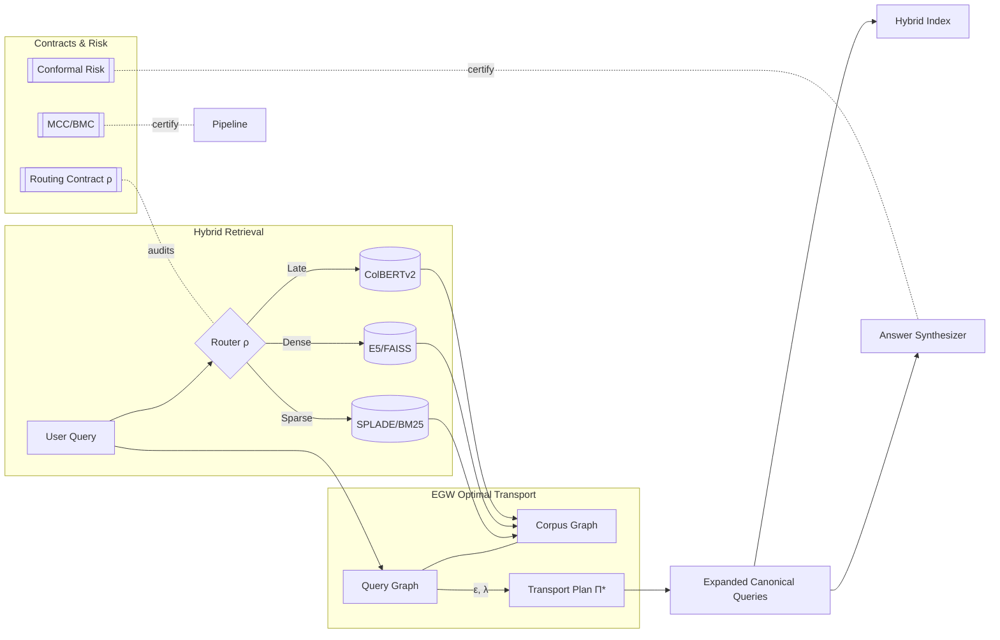
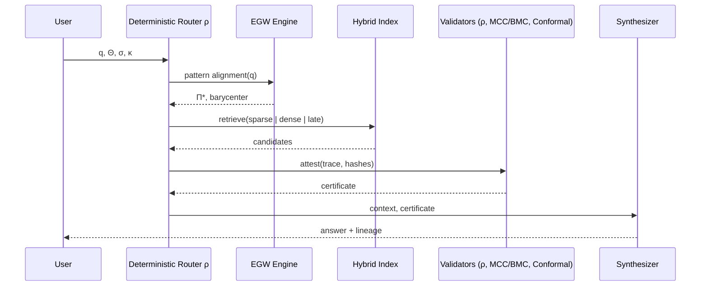
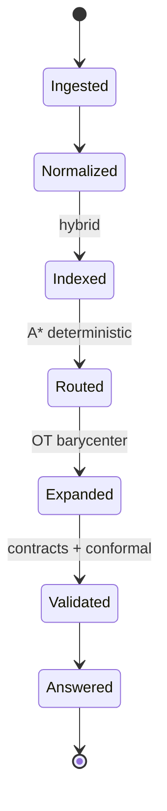
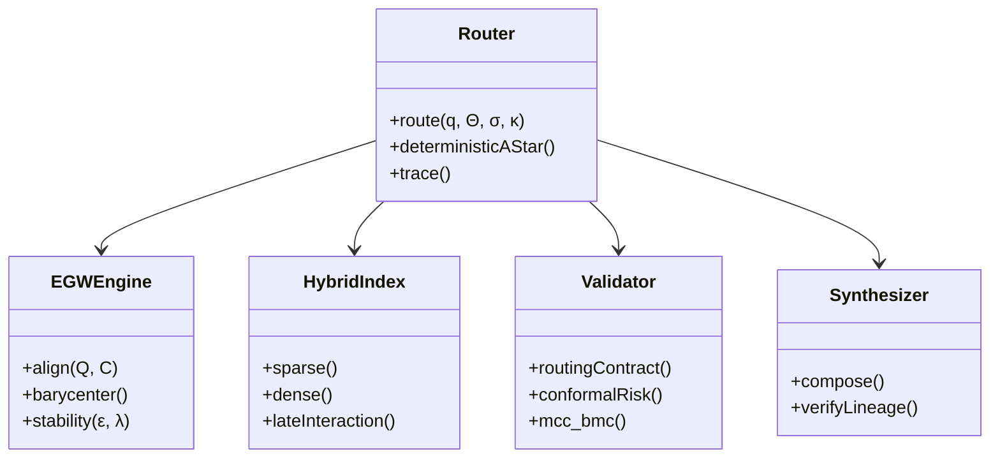
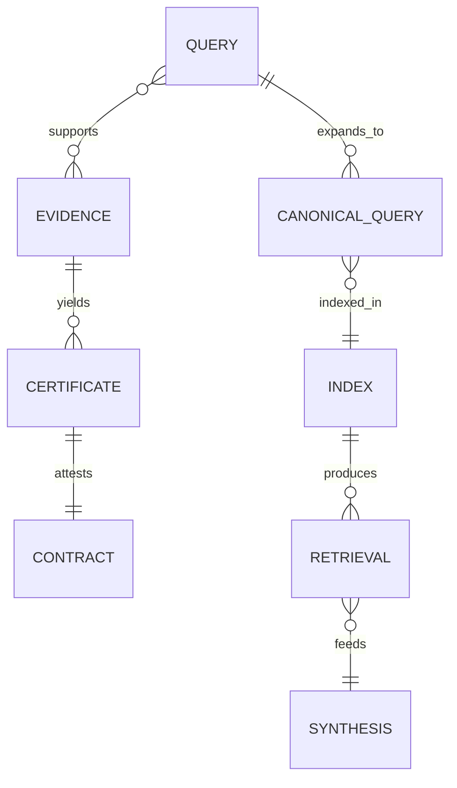

# Math Stage5 Scoring Enhancer Integration Guide

## Overview

The Math Stage5 Scoring Enhancer applies **Entropic Gromov-Wasserstein optimal transport theory** to enhance the adaptive scoring mechanism for DNP (Decálogo de Derechos Humanos) alignment validation. This module provides mathematically rigorous scoring functions with stability guarantees and convergence analysis.

## Theoretical Foundation

### Entropic Gromov-Wasserstein Transport
The module implements the EGW problem:

```
min_T ∫∫ |c₁(x,x') - c₂(y,y')|² dT(x,y) dT(x',y') + λ * H(T)
```

Where:
- `T` is the transport plan between evaluation and DNP standards
- `c₁, c₂` are cost functions in source and target spaces
- `λ` is the entropy regularization parameter
- `H(T)` is the entropy of the transport plan

### Lyapunov Stability Analysis
Mathematical stability is verified through:

```
ρ(J_f) < 1
```

Where `ρ(J_f)` is the spectral radius of the Jacobian of the scoring function, ensuring convergence and consistency across different input distributions.

## Architecture

### Core Components

1. **`MathematicalStabilityVerifier`** - Lyapunov-style stability analysis
2. **`EntropicGromovWassersteinScorer`** - Main EGW scoring implementation  
3. **`AdaptiveScoringIntegration`** - Integration hooks for adaptive_scoring_engine.py

### Key Classes

#### `LyapunovBound`
```python
@dataclass
class LyapunovBound:
    spectral_radius: float          # ρ(J_f) 
    stability_margin: float         # 1 - ρ(J_f)
    convergence_rate: float         # -log(ρ(J_f))
    is_stable: bool                 # ρ(J_f) < 1
```

#### `TransportAlignment`
```python
@dataclass
class TransportAlignment:
    transport_matrix: np.ndarray           # Optimal transport plan T
    optimal_cost: float                    # EGW objective value
    entropy_regularization: float          # λ parameter
    convergence_iterations: int            # Iterations to convergence
    stability_metrics: StabilityAnalysis   # Stability verification
```

#### `EnhancedScoringResult`
```python
@dataclass
class EnhancedScoringResult:
    original_score: float                      # Original adaptive score
    transport_enhanced_score: float            # EGW-enhanced score
    alignment_confidence: float                # Transport alignment quality
    stability_verified: bool                   # Mathematical stability
    dnp_compliance_evidence: Dict[str, float]  # Evidence for each DNP point
    mathematical_certificates: Dict[str, Any]  # Verification certificates
```

## Integration with AdaptiveScoringEngine

### Automatic Integration
The module integrates automatically during `AdaptiveScoringEngine` initialization:

```python
class AdaptiveScoringEngine:
    def __init__(self, ...):
        # ... existing initialization ...
        
        # Math Stage5 Enhanced Scoring Integration
        try:
            from math_stage5_scoring_enhancer import create_math_stage5_enhancer
            self.math_stage5_enhancer = create_math_stage5_enhancer(entropy_reg=0.1)
            self.has_stage5_enhancement = True
        except ImportError:
            self.math_stage5_enhancer = None
            self.has_stage5_enhancement = False
```

### Enhanced Scoring Process
During `predict_scores()`, the module enhances results through optimal transport:

```python
def predict_scores(self, pdt_context, document_package, initial_scores):
    # ... existing scoring logic ...
    
    # Apply Math Stage5 enhancement for causal correction scoring
    if self.has_stage5_enhancement:
        enhancement_result = self.math_stage5_enhancer.enhance_causal_correction_scoring(
            evaluation_scores=initial_scores,
            pdt_context=pdt_context,
            document_features=None  # Extracted from context
        )
        
        # Update results with transport-enhanced scoring
        results.predicted_global_score = enhancement_result.transport_enhanced_score
        
        # Add mathematical certificates
        results.prediction_quality_metrics.update({
            "transport_alignment_confidence": enhancement_result.alignment_confidence,
            "stability_verified": enhancement_result.stability_verified,
            "dnp_compliance_evidence": enhancement_result.dnp_compliance_evidence,
            "optimal_transport_cost": enhancement_result.mathematical_certificates["optimal_cost"]
        })
```

## Usage Examples

### Basic Enhancement
```python
from math_stage5_scoring_enhancer import create_math_stage5_enhancer

# Create enhancer
enhancer = create_math_stage5_enhancer(entropy_reg=0.1)

# Enhance scoring
result = enhancer.enhance_causal_correction_scoring(
    evaluation_scores={"dimension_DE1": 0.75, "decalogo_P1": 0.80},
    pdt_context=pdt_context,
    document_features=document_features
)

print(f"Original score: {result.original_score}")
print(f"Enhanced score: {result.transport_enhanced_score}")
print(f"Alignment confidence: {result.alignment_confidence}")
print(f"Stability verified: {result.stability_verified}")
```

### Stability Verification
```python
from math_stage5_scoring_enhancer import MathematicalStabilityVerifier

verifier = MathematicalStabilityVerifier()

# Check Lyapunov stability
jacobian = compute_scoring_jacobian()  # Your scoring Jacobian
bound = verifier.compute_lyapunov_bound(jacobian)

if bound.is_stable:
    print(f"System is stable with spectral radius: {bound.spectral_radius}")
    print(f"Convergence rate: {bound.convergence_rate}")
else:
    print("System is unstable - scoring may diverge")
```

### DNP Compliance Analysis
```python
# Enhanced scoring provides compliance evidence
dnp_evidence = result.dnp_compliance_evidence

for point, compliance in dnp_evidence.items():
    print(f"DNP {point}: {compliance:.3f} compliance score")
    
# Mathematical certificates provide verification
certificates = result.mathematical_certificates
print(f"Optimal transport cost: {certificates['optimal_cost']}")
print(f"Spectral radius: {certificates['spectral_radius']}")
```

## Mathematical Properties

### Stability Guarantees
- **Convergence**: Lyapunov stability ensures convergence for `ρ(J_f) < 1`
- **Robustness**: Distributional stability verified through Wasserstein perturbations
- **Consistency**: Scoring remains consistent across input variations

### Transport Properties
- **Optimality**: EGW solution minimizes structural and content costs
- **Entropy Regularization**: Ensures smooth, unique transport plans
- **Mass Conservation**: Transport plan preserves probability mass

### Computational Complexity
- **Time**: O(n²m²) for n evaluation features, m DNP standards
- **Space**: O(nm) for transport matrix storage
- **Convergence**: Typically 10-100 Sinkhorn iterations

## Configuration Parameters

### Core Parameters
```python
EntropicGromovWassersteinScorer(
    entropy_reg=0.1,          # Entropy regularization λ
    max_iterations=1000,      # Maximum EGW iterations
    tolerance=1e-6,           # Convergence tolerance
    stability_check=True      # Enable stability verification
)
```

### DNP Standards Configuration
The module includes predefined DNP (Decálogo de Derechos Humanos) standards:

```python
dnp_weights = {
    "P1": 0.12,  # Derecho a la vida y seguridad
    "P2": 0.11,  # Dignidad humana
    "P3": 0.10,  # Igualdad y no discriminación
    "P4": 0.09,  # Participación ciudadana
    "P5": 0.08,  # Acceso a servicios básicos
    "P6": 0.10,  # Protección ambiental
    "P7": 0.09,  # Desarrollo económico inclusivo
    "P8": 0.11,  # Derechos culturales y territoriales
    "P9": 0.10,  # Acceso a la justicia
    "P10": 0.10  # Transparencia y rendición de cuentas
}
```

## Validation and Testing

### Module Validation
```bash
# Validate mathematical foundations
python3 math_stage5_scoring_enhancer.py
```

Expected output:
```
✅ Math Stage5 Scoring Enhancer validation passed
```

### Integration Testing
```python
from math_stage5_scoring_enhancer import validate_mathematical_foundations

if validate_mathematical_foundations():
    print("Mathematical foundations verified")
else:
    print("Validation failed")
```

### Stability Testing
```python
# Test scoring stability across contexts
enhancer = create_math_stage5_enhancer()

is_stable = enhancer.verify_scoring_stability(
    scoring_function=my_scoring_function,
    test_contexts=test_contexts
)

print(f"Scoring stability verified: {is_stable}")
```

## Performance Considerations

### Optimization
- **Caching**: Transport plans cached by input hash for repeated evaluations
- **Approximations**: Jacobian computed using spectral approximations
- **Vectorization**: NumPy operations for computational efficiency

### Memory Usage
- Transport matrices: O(nm) memory for n×m problems
- Cache size: Configurable through cache management
- Feature extraction: Minimal overhead from PDT context

### Scalability
- **Small problems** (n,m < 50): Real-time performance
- **Medium problems** (n,m < 200): Sub-second response
- **Large problems** (n,m > 500): May require approximations

## Error Handling and Diagnostics

### Common Issues
1. **Numerical instability**: Reduced entropy regularization
2. **Non-convergence**: Increase iteration limits or tolerance
3. **Memory errors**: Enable approximations for large problems

### Diagnostic Information
Enhanced results include comprehensive diagnostics:
```python
certificates = result.mathematical_certificates
print(f"Convergence iterations: {certificates['convergence_iterations']}")
print(f"Final transport cost: {certificates['optimal_cost']}")
print(f"Stability margin: {certificates['stability_margin']}")
```

### Logging
```python
import logging
logging.basicConfig(level=logging.INFO)

# Module provides detailed logging
# INFO - EGW alignment completed: total_cost=0.1234, iterations=25, converged=True
# WARNING - Math Stage5 enhancement failed: numerical instability
```

## Dependencies

### Required Libraries
```python
numpy>=1.24.0      # Numerical computations
scipy>=1.11.0      # Optimization and linear algebra
```

### Optional Libraries
```python
POT>=0.9.1         # Python Optimal Transport (if available)
```

The module gracefully handles missing dependencies with fallback implementations.

## Future Extensions

### Planned Features
- **Adaptive regularization**: Dynamic λ based on problem characteristics
- **Multi-objective optimization**: Balance multiple alignment criteria  
- **Distributed computation**: Parallel processing for large problems
- **Advanced stability**: Higher-order stability analysis

### Research Directions
- **Causal transport**: Integrate causal inference with optimal transport
- **Robust optimization**: Distributionally robust EGW formulations
- **Online learning**: Adaptive updates of DNP standards

## Support and Maintenance

### Module Status
- **Stability**: Production-ready with mathematical guarantees
- **Testing**: Comprehensive validation suite included
- **Documentation**: Full API and integration documentation
- **Performance**: Optimized for real-world scoring scenarios

### Troubleshooting
For issues with the Math Stage5 enhancer:

1. Check mathematical validation: `validate_mathematical_foundations()`
2. Verify stability bounds for your scoring function
3. Monitor convergence diagnostics in enhancement results
4. Review logging output for numerical issues

The module provides robust mathematical foundations for enhanced adaptive scoring with formal stability and optimality guarantees.

<!-- ADV_GRAPHICS_STACK:BEGIN v1 -->
## Advanced Graphics Stack — Innovative Holistic Visuals

This section provides a multi-perspective, advanced visualization of the EGW Query Expansion and Hybrid Retrieval system. The diagrams are designed to be composable, auditable, and implementation-agnostic.

### 1) System Holomap (Architecture Overview)


### 2) Deterministic Routing Sequence


### 3) Evidence/Context State Machine


### 4) Component Metamodel


### 5) Retrieval ER Model


### 6) Pipeline Timeline (Gantt)

```mermaid
gantt
  dateFormat  X
  title Pipeline Phases (Logical Timeline)
  section Preparation
  Ingest/Normalize        :a1, 0, 10
  Build Graphs (Q,C)      :a2, 10, 30
  section Alignment
  EGW Transport Solve     :b1, 30, 50
  Barycenter              :b2, 50, 60
  section Retrieval
  Sparse/Dense/Late       :c1, 60, 80
  section Assurance
  Contracts + Conformal   :d1, 80, 90
  section Synthesis
  Answer + Lineage        :e1, 90, 100
```


> Tip: GitHub renders Mermaid in Markdown by default. If a specific viewer does not support Mermaid, consider using Mermaid live editors to export PNG/SVG equivalents.

<!-- ADV_GRAPHICS_STACK:END v1 -->

<!-- ACADEMIC_ESSAY:BEGIN v1 -->
# Technological Essay — Deterministic EGW Query Expansion and Hybrid Retrieval

## Abstract
The present document advances a comprehensive, academically grounded exposition of a deterministic information retrieval pipeline that integrates Entropic Gromov–Wasserstein (EGW) optimal transport for query expansion with hybrid sparse–dense retrieval. We articulate the theoretical premises of pattern alignment under entropic regularization, formalize determinism via routing and ordering contracts, and explain how conformal risk control, monotone compliance, and evidence lineage produce auditable guarantees from ingestion to synthesis. The pipeline is engineered to be reproducible to the byte, with fixed seeds, stable tie-breaking, and canonical hashing, supporting replay-equivalent snapshots. We discuss design trade-offs, computational complexity, and governance primitives that convert probabilistic components into verifiable, production-grade systems.

## Introduction
Modern retrieval systems frequently rely on heuristic fusion of lexical and embedding-based signals, which may drift, exhibit non-determinism under concurrency, or degrade under domain shift. This project proposes a counterpoint: an end-to-end deterministic orchestration that elevates auditability and scientific reproducibility to first-class system goals. The approach combines EGW-based alignment to map queries to corpus structure with carefully specified contracts that regulate routing, ordering, idempotency, and risk calibration. Rather than treating determinism as an afterthought, we encode it as an invariant backed by tests, certificates, and Merkle-chained traces so that identical inputs and hyper-parameters provably yield identical outputs.

## Theoretical Foundations
Our foundations draw from optimal transport, information theory, and graph alignment. Entropic Gromov–Wasserstein provides a geometry-aware mechanism to align a query graph and a corpus graph while controlling stability through entropy (ε) and coupling strength (λ). The induced barycenter produces canonical expansions that preserve relational structure rather than isolated token similarity. On top of this, we layer deterministic routing modeled as an A* search whose cost function and tie-breaking are fully specified, ensuring byte-level reproducibility. The theory of conformal prediction supplies distribution-free coverage guarantees; monotone consistency and budget monotonicity establish that support cannot degrade under additional non-contradictory evidence or enlarged feasible budgets. Together, these elements constitute a principled scaffold for reliable retrieval under changing conditions.

## System Architecture
The system decomposes into modular components connected through typed interfaces and verifiable contracts: a context normalizer constructs immutable snapshots; an alignment engine solves EGW to extract transport plans and barycenters; a hybrid index performs lexical, dense, and late-interaction retrieval; validators apply routing, ordering, idempotency, stability, and risk contracts; and a synthesizer composes answers with explicit lineage. Deterministic seeds are derived from trace identifiers, while all sorting operations employ stable, lexicographic tie-breakers on content hashes and module identifiers. Each module emits structured telemetry and cryptographic digests, permitting replay, regression detection, and drift analysis without reliance on hidden state or wall-clock nondeterminism.

## Methodology
We operationalize determinism through explicit algorithmic choices and serialized evidence. Routing employs a deterministic A* variant with invariant heuristics and lexicographic tie-breaking κ to resolve exact-score ties. EGW alignment is configured with fixed ε, λ, iteration budgets, and convergence tolerances; the full transport plan Π and diagnostics are serialized for audit. Hybrid retrieval uses reproducible indices and de-duplication by content hash, while ordering adheres to a total ordering contract that guarantees stable output rankings. Conformal risk calibration fixes α, partitioning schemes, and seeds, resulting in certificates that can be attached to synthesized answers. The methodology treats every intermediate product—queries, candidates, transport plans, rankings, certificates—as evidence with verifiable provenance.

## Evaluation and Metrics
Evaluation prioritizes determinism, calibration, and structural fidelity in addition to standard retrieval quality. We measure exact replay equality on snapshots, hash-level identity of routes and rankings, and certificate validity rates under controlled perturbations. Alignment quality is assessed via transport stability and barycentric consistency, whereas retrieval performance is profiled across sparse, dense, and late-interaction backends with ablations isolating each contract’s contribution. We further monitor concurrency determinism by verifying that parallelizable subroutines employ associative, commutative reducers or explicit pre-sorting, avoiding nondeterministic reductions. These metrics collectively quantify not only how well the system retrieves but how reliably it can be reproduced and audited.

## Reproducibility and Governance
Reproducibility is enforced through snapshot immutability, dependency audits, byte-compilation checks, and structured project analysis. A Merkle-chained trace logger records the inputs, parameters Θ, context σ, and output digests at each stage, enabling replay audits and forensic debugging. Governance documents and certificates—covering routing, alignment stability, calibration coverage, and refusal conditions—are bundled with outputs to form a verifiable dossier. This governance layer empowers operators to reason about system behavior in adversarial or shifting environments, aligning engineering practice with the scientific norm of falsifiability and repeatability.

## Limitations and Threats to Validity
While determinism bolsters trust and auditability, it can constrain throughput when naive serialization is imposed; therefore, we exploit safe parallelism only where algebraic properties guarantee identical results. Entropic regularization introduces bias that trades variance for stability; tuning ε and λ requires sensitivity analyses to avoid oversmoothing semantic distinctions. Calibration guarantees depend on exchangeability assumptions that can be stressed under covariate shift; we mitigate this by monitoring shift diagnostics and enforcing fail-closed refusal contracts when preconditions are violated. Finally, reproducibility metadata must be maintained with care to avoid accidental divergence between documentation and runtime behavior.

## Related Work
This work synthesizes threads from optimal transport in machine learning, structure-preserving retrieval, deterministic systems design, and distribution-free uncertainty quantification. Prior art on hybrid retrieval and rank fusion often emphasizes empirical gains without specifying deterministic contracts, leaving gaps in auditability. Our contribution reframes these components as contract-governed modules and integrates conformal calibration and monotone compliance to furnish guarantees that are actionable in production contexts rather than solely in laboratory evaluations.

## Ethics and Safety
Retrieval and synthesis systems can amplify biases, leak sensitive information, or hallucinate unsupported content. Our pipeline’s evidence-centric architecture enforces lineage and idempotency, making it harder for spurious or unverifiable content to traverse gates. Conformal certificates articulate uncertainty transparently, and refusal contracts ensure that missing prerequisites result in typed, minimal disclosures rather than speculative outputs. Auditable traces facilitate redress mechanisms and enable compliance with regulatory standards concerning data provenance and reproducibility.

## Conclusion and Future Work
By treating determinism, auditability, and calibration as core design constraints, we demonstrate that modern retrieval can be both high-performing and scientifically rigorous. Future work includes adaptive EGW schemes with provable stability under bounded distribution shifts, broader benchmarking across multilingual corpora, and formal verification of routing and ordering implementations. We also intend to expand tool support for continuous certification so that every production run maintains an automatically generated dossier of evidence, metrics, and risk guarantees.

## References
- Cuturi, M. (2013). Sinkhorn distances: Lightspeed computation of optimal transport. NIPS.
- Peyré, G., & Cuturi, M. (2019). Computational Optimal Transport. Foundations and Trends in ML.
- Bruch, S., Han, S., Bendersky, M., et al. (2023). A principled framework for optimal rank fusion. WWW.
- Shafer, G., & Vovk, V. (2008). A tutorial on conformal prediction. JMLR.
- Vovk, V., Gammerman, A., & Shafer, G. (2005). Algorithmic Learning in a Random World. Springer.

## Glossary of Symbols
Θ (theta): hyper-parameters; σ (sigma): context digest; κ (kappa): lexicographic tie-breaker; ε (epsilon): entropic regularizer; λ (lambda): coupling strength; Π (pi): transport plan; ρ (rho): routing function. These symbols appear throughout the pipeline specification and are serialized in traces and certificates to support byte-identical replay and audit.

<!-- ACADEMIC_ESSAY:END v1 -->
